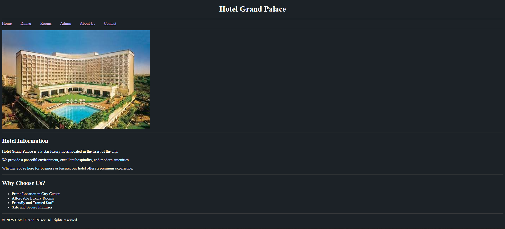
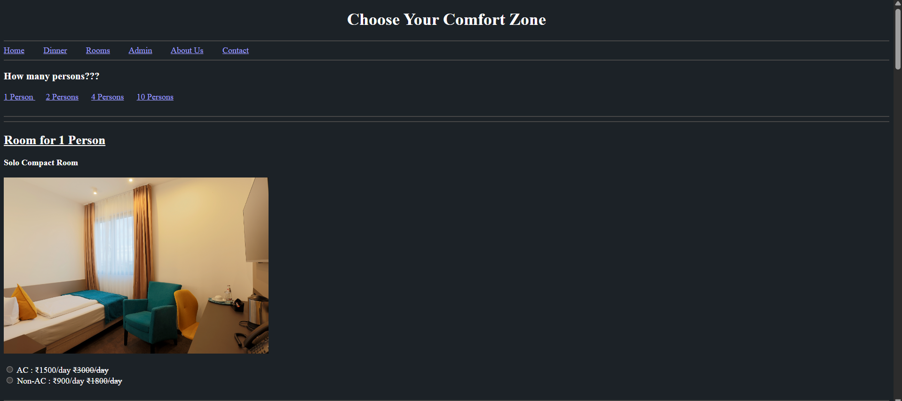
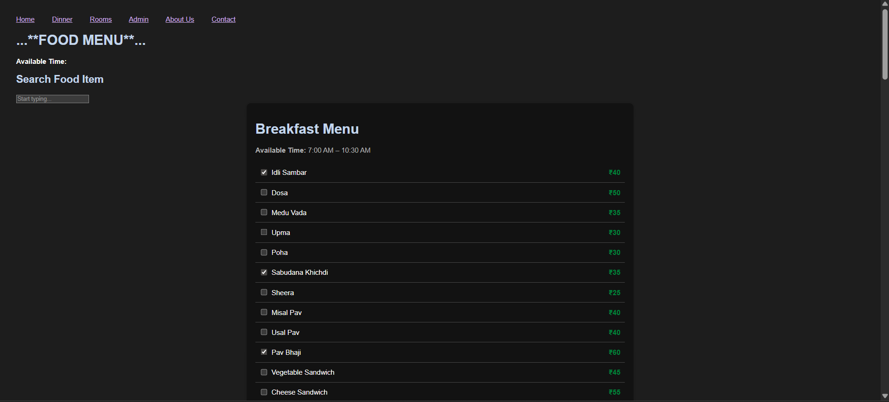
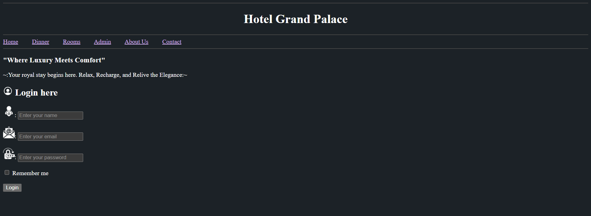
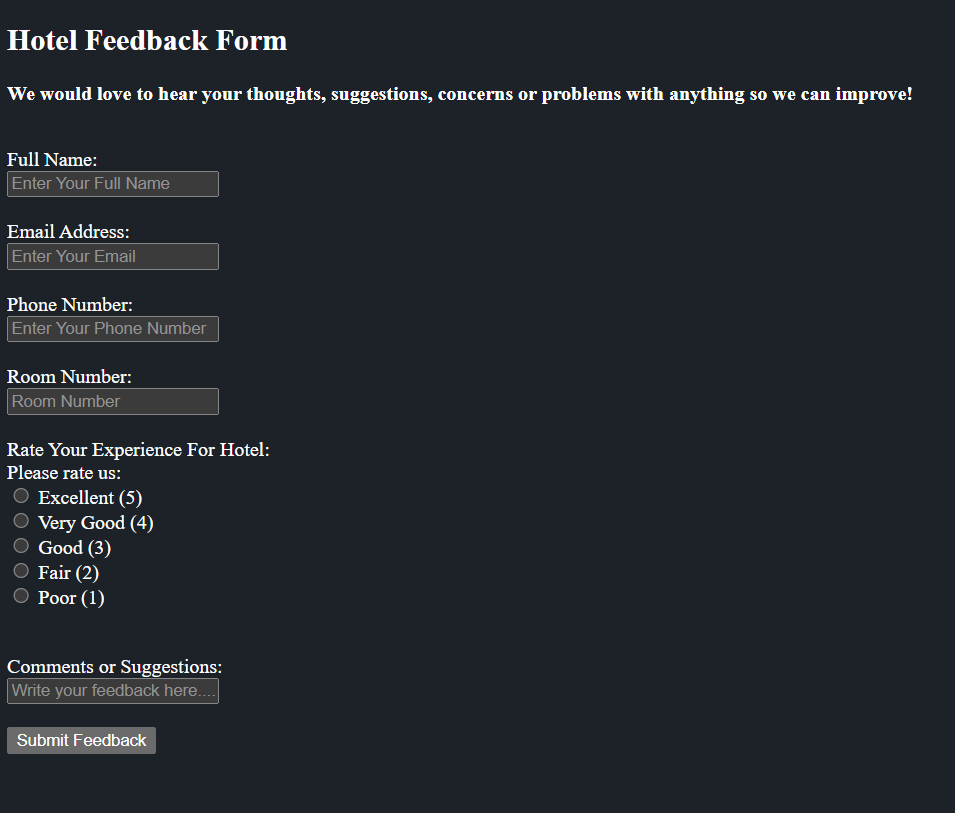

# 🏨 Hotel Management System - Hotel Grand Palace

Welcome to the **Hotel Management System** project built using only **HTML5**.  
This mini project is designed for beginners to understand how a simple hotel website can be structured using basic HTML pages — no CSS or JavaScript required.

---

## 🌐 Navigation Menu

The website includes links to all main pages:
- 🏠 Home
- 🍽️ Dinner
- 🛏️ Rooms
- 🔒 Admin
- ℹ️ About Us
- 📞 Contact

```html
<a href="index.html">Home</a>
<a href="dinner.html">Dinner</a>
<a href="roomdetails.html">Rooms</a>
<a href="admin.html">Admin</a>
<a href="about.html">About Us</a>
<a href="contact.html">Contact</a>
```


## ✨ Project Features

- ✅ Simple homepage with welcome message and navigation bar
- ✅ Dinner menu page with food items and prices
- ✅ Room details page with guest options and pricing
- ✅ Admin login form with basic fields
- ✅ About us page with hotel description
- ✅ Contact page with phone and email info
- ✅ Feedback form for user reviews
- ✅ Payment form with card input fields
- ✅ Booking form for selecting room type and dates

All features are built using **only HTML**.

---

## 🛏️ Room Details Page

The room page includes:
- Rooms for 1, 2, 4, or 10 persons
- AC and Non-AC options
- Pricing and selection guidance
- Link to the booking form



---

## 🍽️ Dinner Section Page

Dinner menu includes:
- Welcome message
- Menu items with prices (e.g., Paneer, Biryani, Thali)
- Simple unordered list layout



---

## 🔐 Admin Login Page

Basic HTML form includes:
- Name
- Email
- Password
- "Remember Me" checkbox
- Submit button



---

## 📞 Contact Page

Displays:
- 📧 Email ID: `grandpalacehotel@example.com`
- 📱 Phone Number: `+91 9387887422`


---

## 💬 Feedback Page

A simple form with:
- Name
- Email
- Feedback textarea
- Submit button



---

## 💳 Payment Page

Form contains:
- Cardholder Name
- Card Number
- Expiry Date
- CVV
- Submit button


---

## 📄 Pages Included

| Page Name        | File Name        | Description                                     |
|------------------|------------------|-------------------------------------------------|
| 🏠 Home           | `index.html`      | Welcome page and site navigation                |
| ℹ️ About Us       | `about.html`      | Description about the hotel                     |
| 🔒 Admin Panel   | `admin.html`      | Admin login form                                |
| 📞 Contact        | `contact.html`    | Contact information                             |
| 🍽️ Dinner Menu   | `dinner.html`     | List of dinner items with pricing               |
| 💬 Feedback       | `feedback.html`   | Collect user reviews                            |
| 💳 Payment        | `payment.html`    | Payment entry form                              |
| 🛏️ Room Booking  | `booking.html`    | Booking form for rooms                          |
| 📃 Room Details  | `roomdetails.html`| AC/Non-AC room types and pricing                |

---

## 🛠️ Technologies Used

- ✅ HTML5 (only)

---

## 🚀 How to Run the Project

1. **Download** or **clone** this project folder.
2. Make sure all `.html` files and image files are in the same directory (or correct subfolders).
3. Open the `index.html` file in any web browser (Chrome, Firefox, Edge, etc.).
4. Click through the navigation links to explore the site.

---

## 📚 Educational Purpose

This project is created to help beginners understand:
- How to structure a multi-page website using HTML
- Navigation using anchor tags
- Form creation and layout using basic tags
- Semantic use of headings, lists, and input types

---

## 👥 Contributors

- Rohan Shedage. (`index.html`)
- Akshada Sanap. (`dinner.html`)
- Janhvi Badwaik. (`roomdetails.html`,`booking.html`,`payment.html`)
- Akash Lohar. (`admin.html`)
- Devki Darandale. (`about.html`)
- Shreya Ambade. (`contact.html`,`feedback.html`)

---

## 📄 License

This project is for **educational purposes only**. No commercial use permitted without permission.
